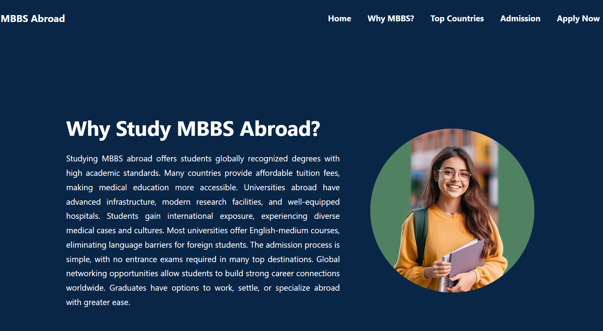

 # Study MBBS Abroad 
 
  ## 🌍 About the Project

###  This project is a comprehensive platform for students aspiring to study MBBS abroad. It provides detailed information about various universities, admission requirements, and benefits of studying overseas. The website ensures a seamless user experience with a clean and modern UI. It is optimized for fast loading and smooth navigation across devices. The content is structured to help users make informed decisions easily. A contact form is integrated for inquiries and assistance. Mobile responsiveness ensures accessibility on all screen sizes.The project is deployed on Netlify/Vercel for easy access.

##  Key Features

##  University Listings :  
Detailed profiles of top medical universities across various countries.
Essential details like ranking, tuition fees, and admission deadlines.

##  Admission Process & Requirements :
Step-by-step guidance on how to apply for MBBS programs abroad.
Eligibility criteria breakdown for different universities.

##  Modern & Clean UI :
User-friendly design for easy navigation.
Minimalist yet informative layout to enhance readability.

##  Optimized Performance :
Fast loading speed for a smooth browsing experience.
Cross-device compatibility ensuring accessibility on all screen sizes.

##  Integrated Analytics & Performance Tracking :
Google Analytics & tracking tools to monitor user engagement.
Insights to continuously improve the user experience.

##  Contact Form for Inquiries :
Simple and effective contact form to get assistance.
Users can ask queries related to universities, admission processes, or visa guidance.

##  Mobile Responsiveness :
Fully responsive across all devices (mobile, tablet, and desktop).
Adaptive design for seamless interaction.

##  Tech Stack Used : 
### Frontend: HTML, CSS, JavaScript.

##  Screenshots:
I have attached the screenshots below for reference.

